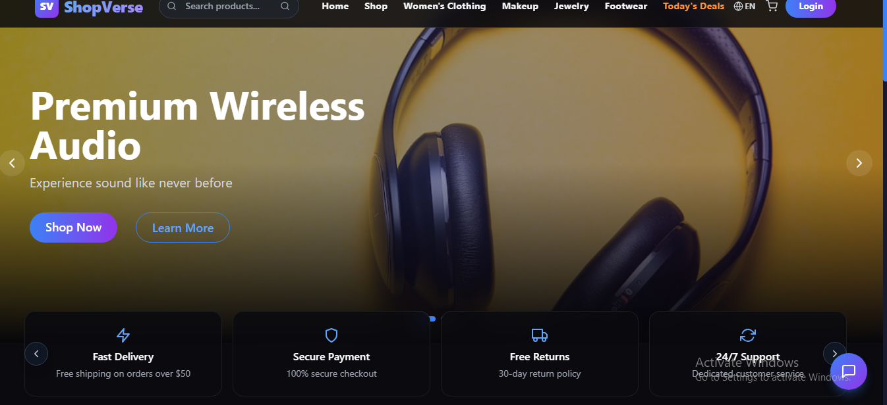

## 📸 Screenshot


````md
# 🛍️ Shop Frontend

A responsive e-commerce frontend built with **React.js** featuring product browsing, shopping cart functionality, and a modern user interface.

## 🌐 Live Demo

🔗 https://shop-frontend-psi-sandy.vercel.app/

## ✨ Features

- Responsive Design
- Product Listing
- Product Details
- Shopping Cart
- Add & Remove Items
- Quantity Management

## 🛠️ Tech Stack

- React.js
- JavaScript
- React Router DOM
- CSS3
- Vite

## 🚀 Installation

```bash
git clone https://github.com/iqraaslam123/your-repository-name.git

cd your-repository-name

npm install

npm run dev
``
## 👩‍💻 Author

**Iqra Aslam**

- GitHub: https://github.com/iqraaslam123
- LinkedIn: https://www.linkedin.com/in/iqra-aslam-4046812ba
- Portfolio: https://newportfolio-one-zeta.vercel.app/
````
